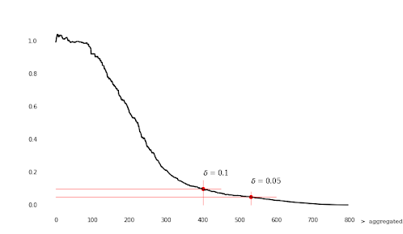
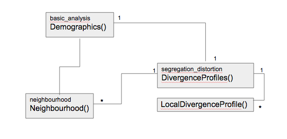

# segregation_index module

This module enables users to compute a new segregation measure, the distortion index, for city level units. 
The procedure used here is based on the method described by [Olteanu and al.(2018)][1]. From local level KL divergence,
KL profiles are computed step by step while progressively aggregating closest neighbours. 
Unlike many segregation measures, the distortion index is shown to be multi scalar and multi-ethnic.

## Introduction

### The method
Segregation can be seen as the divergence from a random configuration of an evenly distributed population. 
An appropirate local measure is thus the KL divergence that returns the difference between the distribution
in the local area and the global distribution of the city [Amari and Shun-ichi (2010)][2]. The method described here goes beyond the local scale of 
the administrative units by including neighbourhing distributions in the local experience of segregation. 
To do this, given an origin unit, all neighbours are sorted by a particular metric, from the closest one to the farthest. 
This ordered list computed for all origin units represents the neighbourhood structure of the city. 
The KL divergence is then calculated for each aggregation level, as new neighbours are included at each step, 
thus creating the KL divergence profile. 
These profiles converge more or less quickly to 0. Given a threshold T, we define the focal distance f(T) 
which represents the aggregation level for last passage of the curve under T. 
By averaging f over all possible values of T, we get a multi-scalar indicator, the distortion index. 

### The module organistation
This library is organised in different independant modules:

- basic_analysis: used to synthetise demographic information for easy process with numpy.
    * Demographic() returning specific demographic figures and population matrix. 
    * LorenzCurve() retruning the lorenz curve and gini index relative to spatial population concentration.

- neighbourhood: used to create a neighbourhod structure as the most computationally expensive procedure. 
    * Neighbourhood() returning the neighbourhood structure for all units in a city, given a shapefile dataframe. 

- segregation_index: used to compute the indices and plot the maps and profiles
    * DivergenceProfiles() returning the city framework with basic demographic and geographic information (from basic_analysis), 
    a neighbourhood structure and divergence profiles and indices for all the statistical units. 
    This class is dependant on Neighbourhood, Demography, LocalDivergenceProfile.
    * LocalDivergenceProfile() returning the profile and indices for one given cell.

- random_grid: mainly used to test the module and check divergence from randomness. 
  * RandomGrid() returning a dataframe with evenely distributed population on a square lattice.
  * GeoGrid() given a RandomGrid() object, will return a GeoPandas version with Polygon objects for square units. 
  
The dependancy graph of the modules:

## Requirements

The main modules required to run the code are:
- pandas
- geopandas
- numpy
- matplotlib
- seaborn
- pickle
- random
- shapely
- math

## Installation
To use this module, please dowload the source code from (link).

## Usage

To compute segregation indices for a given city, start by formatting the city-level data into a shapefile 
with a geometry column and population group variables. Create a city framework with segregation_distortion.DivergenceProfiles, 
setup the neighbourhood structure and compute the profiles for each statistical unit. 
Various plotting methods are available to visualise results. 

For more details on how to use this module, please check-out our Chicago example over (here)!!

## Contribution
This module is open to contribution. To add any changes to the method please contact cecidebezenac@gmail.com and request a pull! 
Be sure to test your changes with the test_distortion.py available on the GitHub page. 

[1]:https://www.pnas.org/content/116/25/12250.short?rss=1 
[2]:https://www.researchgate.net/publication/228646641_Information_geometry_of_divergence_functions 

## License

[MIT](https://choosealicense.com/licenses/mit/)

